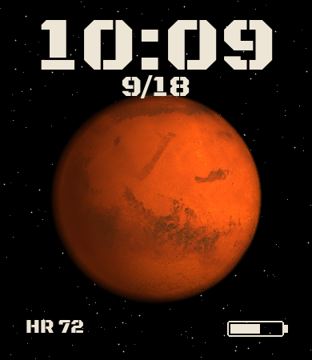

# Mars

Amazfit Bip 6 watchface (390×450). Mars completes one rotation per Earth day.



## Face

- Photoreal globe from a NASA Viking–derived albedo map
- 48 globe frames on a static starfield, 7.5° every 30 minutes
- The face refreshes the globe when the watch wakes and on each minute
- Lighting is fixed (sun from the right-front); the surface turns under it
- Industrial stencil time `HH:MM` (Black Ops One)
- Date as `M/D` (no leading zeros)
- Heart rate and a battery bar

Mars’s true solar day is about 24h 40m. This face uses 24h 00m so the planet stays in sync with the clock.

## Build

Needs [Node.js](https://nodejs.org/), Python 3 with Pillow and NumPy, and [Zeus CLI](https://docs.zepp.com/docs/guides/tools/cli/):

```
npm i @zeppos/zeus-cli -g
python scripts/generate_assets.py
zeus build
zeus preview -t "Amazfit Bip 6"
```

Sideload with Zepp Developer Mode: Profile → Settings → About → tap the Zepp logo until Developer Mode is on, then scan the preview QR.

`scripts/generate_assets.py --glyphs` regenerates fonts and UI art without re-rendering Mars.

To re-render the globe, put a Mars equirectangular map at `tools/mars_tex.jpg` (the copy used here came from the [threex.planets](https://github.com/jeromeetienne/threex.planets) NASA-derived 1k texture).

## Layout

`watchface/layout.js` is generated by the asset script. Change `scripts/generate_assets.py` and regenerate rather than hand-editing it.

## Licenses

- Watchface code: see [LICENSE](LICENSE)
- Black Ops One (Sorkin Type Co / James Grieshaber): SIL Open Font License 1.1, reserved name “Black Ops” — [OFL](assets/default/fonts/OFL.txt)
- Mars albedo: NASA Viking imagery via a public planet-texture pack
